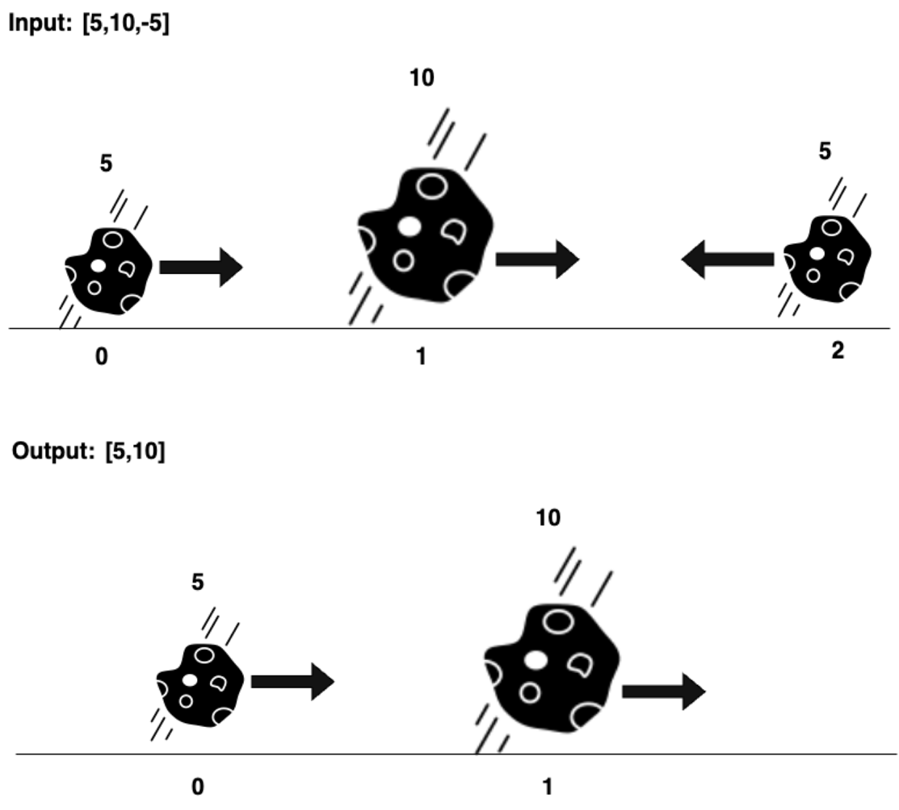
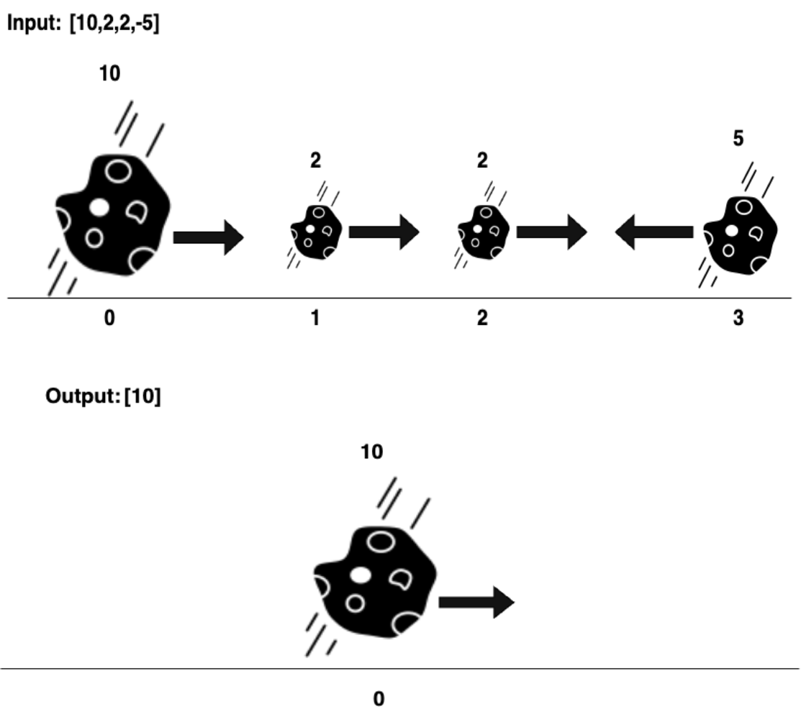
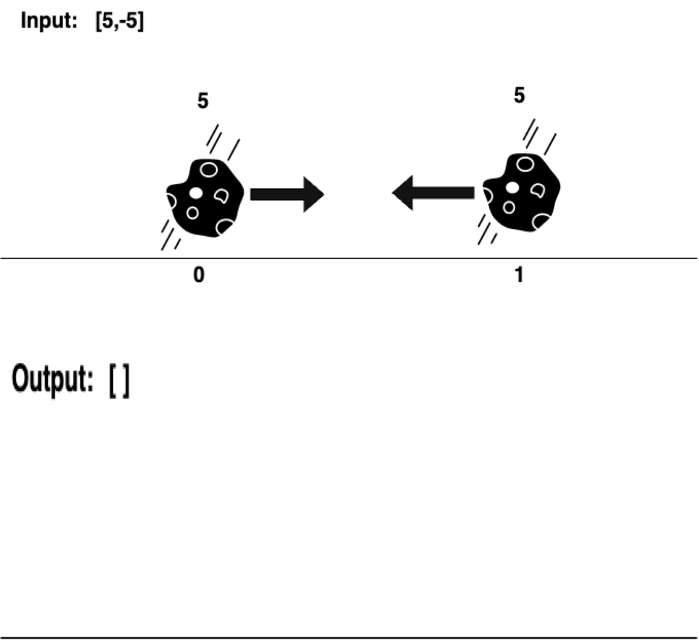

<h1>735. Asteroid Collision</h1>

We are given an array asteroids of integers representing asteroids in a row. The indices of the asteriod in the array represent their relative position in space.

For each asteroid, the absolute value represents its size, and the sign represents its direction (positive meaning right, negative meaning left). Each asteroid moves at the same speed.

Find out the state of the asteroids after all collisions. If two asteroids meet, the smaller one will explode. If both are the same size, both will explode. Two asteroids moving in the same direction will never meet.

<b>Example 1:</b>

Input: asteroids = [5,10,-5] 
Output: [5,10] 
Explanation: The 10 and -5 collide resulting in 10. The 5 and 10 never collide. 

<b>Example 2:</b>

Input: asteroids = [8,-8] 
Output: [] 
Explanation: The 8 and -8 collide exploding each other. 

<b>Example 3:</b>

Input: asteroids = [10,2,-5] 
Output: [10] 
Explanation: The 2 and -5 collide resulting in -5. The 10 and -5 collide resulting in 10.

<b>Constraints:</b>

2 <= asteroids.length <= 104 
-1000 <= asteroids[i] <= 1000 
asteroids[i] != 0

 

<h3> Case 1:

    <h3> Case 2:</h3>

     <h3> Case 3:

    <h3> Case 4: 

    <h3> Case 5:

  